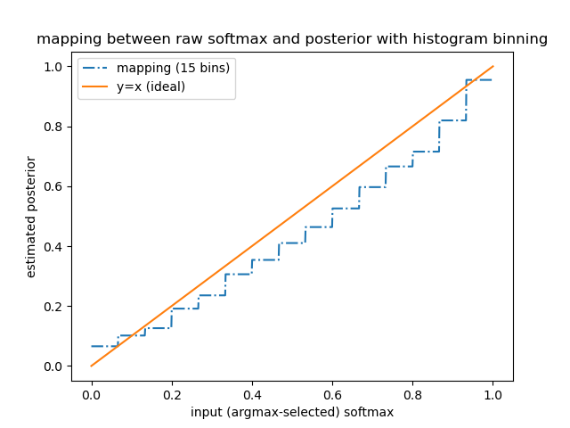
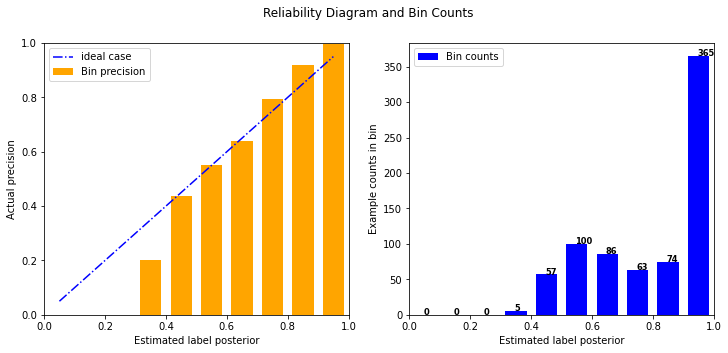

## Neural Network Calibrations
This repo contains the following calibration methods for deep neural networks:
- Histogram Binning [1]
- Temperature Scaling (global and class-wise) [2]


## Setup
- python 3.x
- pytorch>=1.8
- matplotlib
- numpy

## Histogram Binning
The histogram binning [1] approach is implemented within the class `histogram_binning_calibration`. Further more, a linear rescaling of the remaining
softmax scores according to the calibrated argmax-selected softmax score is also
implemented.

#### Example
```python
# load base model
base_model = load_model(model_path)
device = 'cuda'

# initialize class instance
n_bins = 15 # number of bins in the histogram
hist_est = histogram_binning_calibration(base_model,n_bins,device)

# setup validation set data loader here

# learn histogram from validation examples
hist_est.histogram_binning(val_loader)

# setup test set data loader here

# apply histogram binning on test data
sm_calib, flags, preds = hist_est(test_data)
```

#### Visualization of the mapping between raw softmax and calibrated posterior
```python
# call the viz_of_mapping_function() method after applying histogram binning
hist_est.viz_of_mapping_function()
```


## Temperature scaling
The temperature scaling [2] approaches are implemented within the `ModelWithTemperature` class. This class can either learn or grid-search for an appropriate temperature scalar both globally or per-class.

#### Example (Grid Search)
```python
# Setup values to iterate over during learning or grid search
# For the grid search approach
temps = torch.linspace(0.25, 4.0, 1000)
# For the learned approach
lrs = torch.linspace(0.001, 0.01, 10)
num_iters = torch.linspace(50, 100, 10)

# load base model
base_model = load_model(model_path)
device = 'cpu'
# number of bins in the histogram
n_bins = 15

# Get per-class or global ece scores
# ece_criterion = PerClassECE(n_bins=NBINS)
ece_criterion = ECE(n_bins=NBINS)

# Returns a tensor of
before_ece = ece_criterion.compute_ece(model, val_loader)
print(f"Before ece: {before_ece}")
# Reliability diagrams and bin count diagram
ece_criterion.reliability_diagram_and_bin_count()


# Create new object
model_temp = ModelWithTemperature(model=base_model,
                            strategy="grid", per_class=True,
                            device=device, n_bins=NBINS)

temperature = model_temp.set_temperature(val_loader,
                            t_vals=list(temps), lrs=list(lrs),
                            num_iters=list(num_iters))

after_ece = ece_criterion.compute_ece(model_temp, val_loader)
# Reliability diagrams and bin count diagram
ece_criterion.reliability_diagram_and_bin_count()
print(f"Final temperature: {temperature}")
print(f"After ece: {after_ece}")
```



## Reference
[1] Bianca Zadrozny, Charles Elkan, "Obtaining Calibrated Probability Estimates from Decision Trees and Naive Bayesian Classifiers," In ICML, pp. 609–616, 2001.
Available: https://cseweb.ucsd.edu/~elkan/calibrated.pdf

[2] Chuan Guo, Geoff Pleiss, Yu Sun, Kilian Q. Weinberger, "On Calibration of Modern Neural Networks," In ICML, pp. 2130–2143, 2017.
Available: https://arxiv.org/abs/1706.04599v2.
